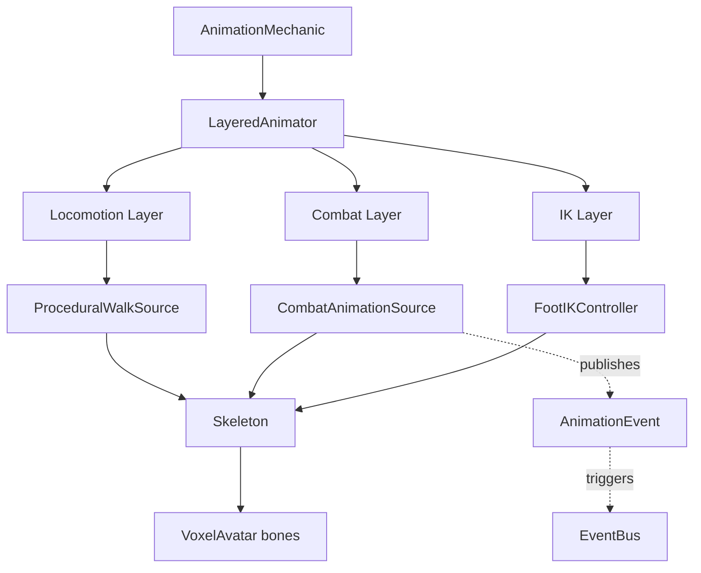

# Animation System

**For Advanced Users**

This document covers the technical architecture of MyCraft's animation system. If you're just using the visual animation editor, you don't need to read this - it's for developers extending the engine or creating custom animation sources.

---

## Overview

The MyCraft animation system is a **hybrid procedural + keyframe** system designed specifically for voxel characters. It combines:

- **Procedural animations**: Runtime-generated animations (walks, idles) that adapt to player state
- **Keyframe animations**: Hand-crafted animations (attacks, dodges) with precise timing
- **Layered composition**: Multiple animation sources blended with bone masking
- **IK integration**: Terrain-aware foot placement for natural movement
- **Event system**: Frame-perfect callbacks for combat timing

Built on Panda3D's scene graph, the system uses transform hierarchies rather than mesh skinning, making it ideal for blocky, modular voxel characters.

---

## Architecture



### Core Classes

| Class | Purpose | File |
|:--|:--|:--|
| `Transform` | Position, rotation, scale for a single bone | [core.py](file:///home/jamest/Desktop/dev/mycraft/engine/animation/core.py#L12-L48) |
| `Keyframe` | Bone transforms at a specific time | [core.py](file:///home/jamest/Desktop/dev/mycraft/engine/animation/core.py#L51-L70) |
| `AnimationClip` | Complete keyframe animation with events | [core.py](file:///home/jamest/Desktop/dev/mycraft/engine/animation/core.py#L73-L127) |
| `AnimationEvent` | Callback triggered at animation time | [core.py](file:///home/jamest/Desktop/dev/mycraft/engine/animation/core.py#L58-L79) |
| `LayeredAnimator` | Composites multiple animation sources | [layers.py](file:///home/jamest/Desktop/dev/mycraft/engine/animation/layers.py#L136-L342) |
| `Skeleton` | Hierarchical bone structure with rest pose | [skeleton.py](file:///home/jamest/Desktop/dev/mycraft/engine/animation/skeleton.py) |
| `VoxelAvatar` | Visual representation (5-part mannequin) | [voxel_avatar.py](file:///home/jamest/Desktop/dev/mycraft/engine/animation/voxel_avatar.py) |

---

## Transform System

The foundation of all animation is the `Transform` class:

```python
@dataclass
class Transform:
    position: LVector3f = LVector3f(0, 0, 0)
    rotation: LVector3f = LVector3f(0, 0, 0)  # Euler HPR
    scale: LVector3f = LVector3f(1, 1, 1)
```

Key features:

- **Panda3D integration**: Direct `apply_to_node()` sets NodePath transforms
- **Interpolation**: `lerp(other, t)` for smooth blending
- **JSON serialization**: Converts LVector3f to `[x, y, z]` lists

---

## Keyframe Animations

### AnimationClip Structure

```python
@dataclass
class AnimationClip:
    name: str
    duration: float
    keyframes: List[Keyframe]
    looping: bool = True
    events: List[AnimationEvent] = []
```

### Keyframe Interpolation

The `get_pose(time)` method finds surrounding keyframes and interpolates:

```python
# Find prev/next keyframes at time=0.75s
prev_kf = Keyframe(time=0.5, transforms={...})
next_kf = Keyframe(time=1.0, transforms={...})

# Interpolate (t = 0.5 between 0.5s and 1.0s)
t = (0.75 - 0.5) / (1.0 - 0.5)  # = 0.5
result = prev_kf.transforms[bone].lerp(next_kf.transforms[bone], 0.5)
```

**Features**:

- Linear interpolation between keyframes
- Looping wraps time modulo duration
- Non-looping clamps at duration

### Animation Events

Events trigger callbacks at specific times:

```python
AnimationEvent(
    time=0.15,
    event_name="impact",
    data={"damage_mult": 1.5}
)
```

**Event firing**:

- Checked each frame during playback
- Fires when `prev_time < event.time <= current_time`
- Handles looping (fires each cycle)
- Deduplication prevents double-firing

**Use cases**:

- Combat hit windows (`hit_start`, `impact`, `hit_end`)
- Footstep sounds
- Particle effects (dust clouds)
- State transitions

---

## Layered Animation

The `LayeredAnimator` enables multiple animation sources to affect different bones simultaneously.

### Animation Layers

```python
@dataclass
class AnimationLayer:
    name: str
    source: AnimationSource
    priority: int = 0        # Higher = applied last (overrides lower)
    weight: float = 1.0      # Blend strength (0-1)
    mask: Optional[BoneMask] = None
    enabled: bool = True
```

### Bone Masking

Bone masks determine which bones a layer affects:

```python
# Upper body only (chest and above)
combat_mask = BoneMask.upper_body()  # chest, neck, head, arms

# Lower body only (hips and below)
locomotion_mask = BoneMask.lower_body()  # hips, legs
```

**Predefined masks**:

- `full_body()`: All bones
- `upper_body()`: Chest, neck, head, shoulders, upper_arms, lower_arms
- `lower_body()`: Hips, thighs, shins
- `arms()`: Shoulders, upper_arms, lower_arms
- `legs()`: Thighs, shins

### Layer Composition Algorithm

```python
def update(self, dt: float):
    # 1. Get transforms from each layer
    layer_poses = []
    for layer in sorted(self.layers, key=lambda l: l.priority):
        if layer.enabled:
            pose = layer.source.update(dt, self.skeleton)
            layer_poses.append((layer, pose))
    
    # 2. Composite poses with masking
    final_pose = {}
    for bone_name in self.skeleton.bones:
        # Apply layers in priority order (low to high)
        for layer, pose in layer_poses:
            if layer.mask.affects_bone(bone_name) and bone_name in pose:
                if bone_name not in final_pose:
                    final_pose[bone_name] = pose[bone_name]
                else:
                    # Blend with previous result
                    final_pose[bone_name] = final_pose[bone_name].lerp(
                        pose[bone_name],
                        layer.weight
                    )
    
    # 3. Apply to skeleton
    self.skeleton.apply_pose(final_pose)
```

### Example: Combat + Locomotion

```python
animator = LayeredAnimator(skeleton)

# Base layer: Full-body walk cycle
animator.add_layer(
    name='locomotion',
    source=ProceduralWalkSource(),
    priority=0,
    mask=BoneMask.full_body()
)

# Combat layer: Upper-body attack (overrides arms/chest)
animator.add_layer(
    name='combat',
    source=CombatAnimationSource(),
    priority=10,
    mask=BoneMask.upper_body()
)

# Result: Legs walk, arms swing sword
```

---

## Skeleton System

The `Skeleton` class manages bone hierarchies and rest poses.

### HumanoidSkeleton (17 Bones)

```text
root
└── hips
    ├── chest
    │   ├── neck
    │   │   └── head
    │   ├── shoulder_left
    │   │   └── upper_arm_left
    │   │       └── lower_arm_left
    │   └── shoulder_right
    │       └── upper_arm_right
    │           └── lower_arm_right
    ├── thigh_left
    │   └── shin_left
    └── thigh_right
        └── shin_right
```

### Rest Transform Logic

Critical for preventing "skeleton collapse":

```python
class Skeleton:
    def __init__(self):
        self.rest_transforms = {}  # Bone -> Transform
        
    def apply_pose(self, pose: Dict[str, Transform]):
        for bone_name, anim_transform in pose.items():
            rest = self.rest_transforms.get(bone_name, Transform())
            
            # Combine: animation rotation + rest position/scale
            final_transform = Transform(
                position=rest.position,      # Keep bone length
                rotation=anim_transform.rotation,  # Animate rotation
                scale=rest.scale             # Keep scale
            )
            
            bone_node.setPos(final_transform.position)
            bone_node.setHpr(final_transform.rotation)
```

**Why?** Animations only specify rotations. Rest transforms preserve bone lengths and proportions.

### Bone Length Constants

```python
# From skeleton.py
THIGH_LEN = 0.32
SHIN_LEN = 0.32
UPPER_ARM_LEN = 0.24
LOWER_ARM_LEN = 0.24
CHEST_HEIGHT = 0.48
NECK_HEIGHT = 0.08
HEAD_HEIGHT = 0.32
```

---

## Procedural Animation

Procedural animations are generated at runtime based on player state.

### ProceduralWalkSource Example

```python
class ProceduralWalkSource(AnimationSource):
    def __init__(self):
        self.walk_phase = 0.0
        
    def update(self, dt: float, skeleton: Skeleton) -> Dict[str, Transform]:
        velocity = skeleton.get_velocity()  # From context
        speed = velocity.length()
        
        # Update phase based on speed
        self.walk_phase += dt * speed * 2.0
        
        # Generate leg swings
        right_leg_angle = math.sin(self.walk_phase) * 25.0
        left_leg_angle = -right_leg_angle
        
        # Generate arm swings (opposite legs)
        right_arm_angle = -right_leg_angle * 1.2
        left_arm_angle = -left_leg_angle * 1.2
        
        return {
            'thigh_right': Transform(rotation=LVector3f(right_leg_angle, 0, 0)),
            'thigh_left': Transform(rotation=LVector3f(left_leg_angle, 0, 0)),
            'upper_arm_right': Transform(rotation=LVector3f(right_arm_angle, 0, 0)),
            'upper_arm_left': Transform(rotation=LVector3f(left_arm_angle, 0, 0)),
        }
```

**Advantages**:

- No keyframes to author
- Naturally adapts to variable speeds
- Lightweight (no clip storage)

**Current procedural animations**:

- Walk cycle (legs + arms swing)
- Idle sway (subtle breathing, head bob)
- Run (faster walk phase)
- Sprint (exaggerated lean + swing)
- Jump/fall (limb pose adjustments)

---

## Combat Animation

Combat uses keyframe clips with precise timing for attacks, dodges, and parries.

### CombatClip Structure

```python
@dataclass
class CombatClip(AnimationClip):
    hit_windows: List[HitWindow]           # When damage can be dealt
    can_cancel_after: float = 0.0          # Earliest cancel time
    momentum_influence: float = 0.3        # Movement speed effect
    recovery_time: float = 0.0             # Post-animation delay
    root_motion: Optional[RootMotionCurve] = None
```

### Example: Sword Slash

```python
clip = CombatClip(
    name='attack_light',
    duration=0.5,
    looping=False,
    keyframes=[
        # Windup (0.0s - 0.12s)
        Keyframe(time=0.0, transforms={
            'upper_arm_right': Transform(rotation=LVector3f(0, -90, 0)),
            'chest': Transform(rotation=LVector3f(0, -20, 0))
        }),
        # Strike (0.15s)
        Keyframe(time=0.15, transforms={
            'upper_arm_right': Transform(rotation=LVector3f(0, 90, 0)),
            'chest': Transform(rotation=LVector3f(0, 20, 0))
        }),
        # Recovery (0.5s)
        Keyframe(time=0.5, transforms={
            'upper_arm_right': Transform(rotation=LVector3f(0, 0, 0)),
            'chest': Transform(rotation=LVector3f(0, 0, 0))
        }),
    ],
    events=[
        AnimationEvent(time=0.12, event_name='hit_start'),
        AnimationEvent(time=0.15, event_name='impact'),
        AnimationEvent(time=0.18, event_name='hit_end'),
    ],
    hit_windows=[HitWindow(start=0.12, end=0.18, damage_mult=1.0)],
    can_cancel_after=0.35  # Can dodge after 0.35s
)
```

---

## Root Motion

Root motion moves the character based on animation curves, creating commitment-based attacks.

### RootMotionCurve

```python
@dataclass
class RootMotionCurve:
    samples: List[Tuple[float, LVector3f]]  # (time, delta_position)
    
    @classmethod
    def attack_lunge(cls, forward_distance: float, duration: float):
        """Fast middle, slow start/end (sine curve)."""
        curve = cls()
        for i in range(15):
            t = i / 15
            progress = (1.0 - math.cos(t * math.pi)) / 2.0
            delta = LVector3f(0, forward_distance * progress, 0)
            curve.add_sample(t * duration, delta)
        return curve
```

### Application

```python
# In AnimationMechanic
root_motion_applicator = RootMotionApplicator()

# Each frame during attack
delta = root_motion_applicator.extract_and_apply(
    clip=combat_clip,
    current_time=0.15,
    dt=0.016,
    kinematic_state=player_state,
    character_rotation=player_heading
)

# Player automatically moves forward 1.2 units over 0.5s
```

---

---

## IK System

The IK (Inverse Kinematics) system adapts bone positions to the environment (terrain, walls).

### Foot IK

The `FootIKController` adjusts feet to match terrain height.

**Algorithm**:

1. **Raycast**: Cast down from above the foot position.
2. **Offset**: Calculate vertical difference between foot bone and terrain.
3. **Adjustment**: Apply rotation to the shin/thigh to lift or lower the foot.

### Hand IK

The `HandIKController` (used in climbing mode) places hands on surface geometry.

**Algorithm**:

1. **Raycast**: Cast forward from the shoulder/chest.
2. **Target**: If a wall is found, set the hand target position to the surface point.
3. **Solver**: Use a 2-bone IK solver (Upper Arm, Lower Arm) to reach the target.

---

## Avatar Implementations

The system supports multiple visual backends for the skeleton.

### VoxelAvatar (Procedural)

The `VoxelAvatar` constructs a visual character using Panda3D primitives (CardMaker cubes).

- **Structure**: Recursive NodePath hierarchy matching the Skeleton bones.
- **Visuals**: simple colored boxes scaled to bone lengths.
- **Usage**: Fallback or aesthetic choice for pure voxel look.

### GLBAvatar (Mesh-Based)

The `GLBAvatar` loads a `.glb` or `.gltf` mesh and articulates it.

**Named Part Matching**:
Instead of using skinning (weighted vertices), this system uses "Rigid Part Parenting":

1. The GLB model is inspected for child nodes named after bones (e.g., "head", "chest", "hand_left").
2. Matching nodes are reparented to the corresponding skeleton bone `NodePath`.
3. Unmatched nodes are parented to the "hips" (root).

**Benefit**: This allows using standard 3D modeling tools (Blender) to create voxel-style characters where limbs are separate objects, preserving the rigid aesthetics while using standard animation pipelines.

---

## Performance Considerations

### Optimization Targets

- **LayeredAnimator**: ~0.1ms per player (3 layers, 17 bones)
- **FootIK**: ~0.05ms per player (30Hz, 2 feet)
- **VoxelAvatar**: ~0.02ms per player (5 parts, simple geometry)

**Total**: ~0.17ms per animated player (supports 100+ players at 60 FPS)

### Profiling Tips

```python
# Add timing to update loop
import time
start = time.perf_counter()
animator.update(dt)
elapsed = (time.perf_counter() - start) * 1000
print(f"Animator: {elapsed:.2f}ms")
```

---

## Related Documentation

- [Combat Architecture](COMBAT_ARCHITECTURE.md) - How animations integrate with combat
- [Animation Editor](ANIMATION_EDITOR.md) - Visual editing tools
- [Equipment System](EQUIPMENT_SYSTEM.md) - Sockets and item attachment
- [Player Mechanics](player_mechanics.md) - Control system integration

---

*Last Updated: 2026-01-04*  
*Version: 1.1*
