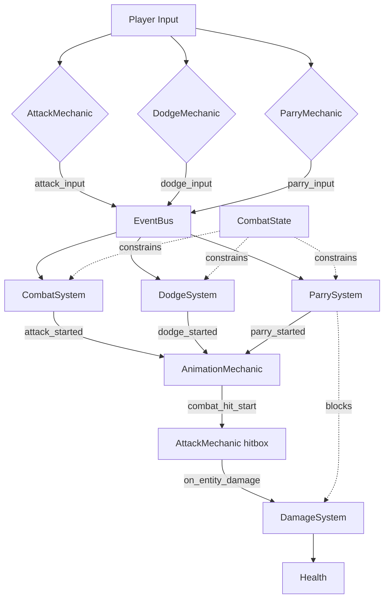

# Combat Architecture

**For Advanced Users**

This document explains how combat is implemented in MyCraft, covering state management, systems, mechanics, and event flows. For gameplay design (timing values, damage formulas), see [COMBAT_SYSTEM.md](file:///home/jamest/Desktop/dev/mycraft/docs/design/COMBAT_SYSTEM.md).

---

## Overview

MyCraft's combat is a **timing-based system** with commitment, momentum, and stamina mechanics. The architecture is distributed across:

- **ECS Components**: `CombatState`, `Health`, `Stamina`
- **ECS Systems**: `CombatSystem`, `DodgeSystem`, `ParrySystem`, `DamageSystem`
- **Player Mechanics**: `AttackMechanic`, `DodgeMechanic`, `ParryMechanic`
- **Animation Integration**: Event-driven hit windows and root motion

**Key Principles**:

1. **Event-driven**: Combat actions publish events, systems subscribe
2. **State-based**: `CombatState` component enforces valid transitions
3. **Animation-synchronized**: Hit windows match animation frames
4. **Physics-integrated**: Root motion applies attack momentum

---

## Architecture Diagram



---

## Combat State Component

The `CombatState` component enforces valid state transitions and action gating.

### Structure

```python
@dataclass
class CombatState:
    state: str = "idle"              # Current state
    state_timer: float = 0.0          # Time in current state
    
    # Action gates
    can_attack: bool = True
    can_dodge: bool = True
    can_parry: bool = True
    can_cancel: bool = True
```

### State Machine

```text
        ┌─────────┐
        │  IDLE   │────┐
        └─────────┘    │
             ▲         │ attack_input
             │         ▼
  recovery_time   ┌──────────┐
       elapsed    │ATTACKING │
             │    └──────────┘
             │         │
        ┌────┴────┐   │ cancel_window
        │RECOVERY │◄──┘
        └─────────┘
```

**States**:

- `idle`: Ready for any action
- `attacking`: Primary attack in progress
- `dodging`: I-frame dodge active
- `parrying`: Parry window active
- `staggered`: Hit during recovery, cannot act
- `recovery`: Post-action delay before returning to idle

### Transition Rules

| From State | To State | Condition | Duration |
|:--|:--|:--|:--|
| idle | attacking | `can_attack && attack_input` | 0.5s |
| idle | dodging | `can_dodge && dodge_input && stamina >= 10` | 0.3s |
| idle | parrying | `can_parry && parry_input` | 0.2s |
| attacking | dodging | `can_cancel && dodge_input` | - |
| attacking | recovery | `elapsed >= attack_duration` | 0.15s+ |
| recovery | idle | `elapsed >= recovery_time` | - |

---

## Combat System

**File**: [games/voxel_world/systems/combat_system.py](file:///home/jamest/Desktop/dev/mycraft/games/voxel_world/systems/combat_system.py)

### Responsibilities

1. Listen to `attack_input` events from `AttackMechanic`
2. Validate attack via `CombatState.can_attack`
3. Start attack: set state to `"attacking"`, disable gates
4. Track attack timing (elapsed time, cancel window)
5. Enable cancel after 0.35s
6. Transition to `recovery` after 0.5s
7. Return to `idle` after recovery period

### Attack State Tracking

```python
class AttackState:
    elapsed_time: float = 0.0
    has_hit: bool = False
```

**Managed per entity**: `active_attacks: Dict[entity_id, AttackState]`

### Update Loop

```python
def update(self, dt: float):
    for entity_id, attack in self.active_attacks.items():
        attack.elapsed_time += dt
        combat_state = self.world.get_component(entity_id, CombatState)
        
        # 1. Enable cancel after cancel window
        if attack.elapsed_time >= 0.35:
            combat_state.can_cancel = True
            combat_state.can_dodge = True
        
        # 2. Check if attack completed
        if attack.elapsed_time >= 0.5:
            combat_state.state = "recovery"
            combat_state.state_timer = 0.0
```

### Attack Execution Flow

```text
1. Player presses Mouse1
   ↓
2. AttackMechanic.update()
   ↓
3. Publishes attack_input event
   ↓
4. CombatSystem.on_attack_input()
   ↓
5. Checks CombatState.can_attack
   ↓
6. Sets state = "attacking", can_attack = False
   ↓
7. Publishes attack_started event
   ↓
8. AnimationMechanic plays attack animation
   ↓
9. Animation events trigger hit windows
   ↓
10. AttackMechanic performs hit detection
    ↓
11. Publishes on_entity_damage events
    ↓
12. DamageSystem reduces Health.current
```

---

## Attack Mechanic

**File**: [engine/player_mechanics/attack_mechanic.py](file:///home/jamest/Desktop/dev/mycraft/engine/player_mechanics/attack_mechanic.py)

### Responsibilities

1. Detect Mouse1 input (rising edge)
2. Publish `attack_input` event
3. Subscribe to `combat_hit_start` / `combat_hit_end` events
4. Activate/deactivate hitbox during hit window
5. Perform cone-based enemy detection
6. Publish `on_entity_damage` events
7. Track hit entities to prevent double-hitting

### Hitbox Activation

```python
class AttackMechanic(PlayerMechanic):
    def __init__(self):
        self.hitbox_active = False
        self.hit_entities = set()
        
    def on_combat_hit_start(self, event):
        """Animation event: hit window opened."""
        self.hitbox_active = True
        self.hit_entities.clear()
        
    def on_combat_hit_end(self, event):
        """Animation event: hit window closed."""
        self.hitbox_active = False
```

### Hit Detection (Cone Check)

```python
def update(self, ctx: PlayerContext):
    if not self.hitbox_active:
        return
        
    # Get player facing direction
    heading_rad = math.radians(ctx.transform.rotation.x)
    forward = LVector3f(-math.sin(heading_rad), math.cos(heading_rad), 0)
    
    # Find entities in range
    for entity_id in ctx.world.get_entities_with(Health):
        if entity_id in self.hit_entities:
            continue  # Already hit
            
        target_pos = ctx.world.get_component(entity_id, Transform).position
        to_target = target_pos - ctx.transform.position
        distance = to_target.length()
        
        # Range check
        if distance > ATTACK_RANGE:
            continue
            
        # Cone angle check (90 degrees = ±45°)
        angle = math.degrees(math.acos(forward.dot(to_target.normalized())))
        if angle > 45:
            continue
            
        # Hit!
        self.hit_entities.add(entity_id)
        ctx.world.event_bus.publish(
            "on_entity_damage",
            target_id=entity_id,
            damage=25.0
        )
```

---

## Dodge System

**File**: [games/voxel_world/systems/dodge_system.py](file:///home/jamest/Desktop/dev/mycraft/games/voxel_world/systems/dodge_system.py)

### Responsibilities

1. Listen to `dodge_input` events
2. Check stamina cost (10 stamina)
3. Set `CombatState` to `"dodging"`
4. Grant i-frames (invincibility) for 0.3s
5. Publish `dodge_started` event for animation
6. Transition to idle after duration

### I-Frame Implementation

```python
class DodgeSystem(System):
    DODGE_DURATION = 0.3
    I_FRAME_DURATION = 0.3  # Full dodge is i-frames
    
    def update(self, dt: float):
        for entity_id, dodge in self.active_dodges.items():
            dodge.elapsed += dt
            
            # I-frames active during entire dodge
            if dodge.elapsed <= self.I_FRAME_DURATION:
                # Set invincibility flag
                combat_state = self.world.get_component(entity_id, CombatState)
                combat_state.invincible = True
            else:
                combat_state.invincible = False
            
            # Complete dodge
            if dodge.elapsed >= self.DODGE_DURATION:
                combat_state.state = "idle"
                combat_state.can_attack = True
```

### Directional Dodges

Dodge direction calculated from WASD input + camera heading:

```python
def on_dodge_input(self, event):
    entity_id = event.entity_id
    
    # Get input direction
    input_dir = LVector3f(0, 0, 0)
    if ctx.input.forward: input_dir.y += 1
    if ctx.input.back: input_dir.y -= 1
    if ctx.input.left: input_dir.x -= 1
    if ctx.input.right: input_dir.x += 1
    
    # Rotate by camera heading
    heading = ctx.world.base.camera.getH()
    # ... rotation math
    
    # Publish with direction data
    self.event_bus.publish("dodge_started",
                          entity_id=entity_id,
                          direction=world_dir)
```

---

## Parry System

**File**: [games/voxel_world/systems/parry_system.py](file:///home/jamest/Desktop/dev/mycraft/games/voxel_world/systems/parry_system.py)

### Responsibilities

1. Listen to `parry_input` events
2. Measure timing relative to incoming attacks
3. Calculate timing quality (perfect/good/bad/failed)
4. Consume stamina (5-20 based on quality)
5. Block or deflect incoming damage
6. Publish `parry_started` event for animation

### Timing Windows

| Quality | Window | Stamina Cost | Effect |
|:--|:--|:--|:--|
| Perfect | ±50ms of impact | 5 | Block + riposte opening |
| Good | ±150ms of impact | 10 | Block damage |
| Bad | ±300ms of impact | 20 | 50% damage reduction |
| Failed | Outside window | 20 | No effect |

### Damage Interception

```python
class ParrySystem(System):
    def initialize(self):
        self.event_bus.subscribe("on_entity_damage", self.on_damage, priority=100)
        # High priority = runs before DamageSystem
        
    def on_damage(self, event):
        target_id = event.target_id
        
        # Check if target is parrying
        combat_state = self.world.get_component(target_id, CombatState)
        if combat_state.state != "parrying":
            return  # Not parrying, damage proceeds
            
        # Calculate timing quality
        parry_time = combat_state.state_timer
        quality = self._calculate_quality(parry_time)
        
        if quality == "perfect":
            event.cancel()  # Block all damage
            self.event_bus.publish("parry_success", quality="perfect")
        elif quality == "good":
            event.cancel()
            self.event_bus.publish("parry_success", quality="good")
        elif quality == "bad":
            event.damage *= 0.5  # Reduce damage
```

---

## Damage System

**File**: [games/voxel_world/systems/damage_system.py](file:///home/jamest/Desktop/dev/mycraft/games/voxel_world/systems/damage_system.py)

### Responsibilities

1. Listen to `on_entity_damage` events (low priority)
2. Reduce `Health.current` by damage amount
3. Check for death (`current <= 0`)
4. Publish `entity_death` event if killed

### Damage Application

```python
class DamageSystem(System):
    def initialize(self):
        self.event_bus.subscribe("on_entity_damage", self.on_damage, priority=50)
        # Low priority = runs after ParrySystem can block
        
    def on_damage(self, event):
        if event.is_cancelled():
            return  # ParrySystem blocked it
            
        target_id = event.target_id
        damage = event.damage
        
        # Get health component
        health = self.world.get_component(target_id, Health)
        if not health:
            return
            
        # Apply damage
        health.current -= damage
        print(f"💔 {target_id} took {damage} damage ({health.current}/{health.max})")
        
        # Check death
        if health.current <= 0:
            self.event_bus.publish("entity_death", entity_id=target_id)
```

---

## Animation Integration

Combat animations drive hit timing through the animation event system.

### Combat Animation Events

**File**: [engine/animation/combat.py](file:///home/jamest/Desktop/dev/mycraft/engine/animation/combat.py)

```python
# Attack animation with events
attack_clip = CombatClip(
    name='attack_light',
    duration=0.5,
    events=[
        AnimationEvent(time=0.12, event_name='attack_hit_start'),
        AnimationEvent(time=0.15, event_name='attack_impact'),
        AnimationEvent(time=0.18, event_name='attack_hit_end'),
    ],
    hit_windows=[HitWindow(start=0.12, end=0.18, damage_mult=1.0)]
)
```

### Event Bridging

**File**: [engine/player_mechanics/animation.py](file:///home/jamest/Desktop/dev/mycraft/engine/player_mechanics/animation.py)

```python
class AnimationMechanic(PlayerMechanic):
    def initialize(self, player_id, world):
        # Register animation event callbacks
        self.animator.register_event_callback('attack_hit_start', self._on_hit_start)
        self.animator.register_event_callback('attack_hit_end', self._on_hit_end)
        
    def _on_hit_start(self, event_data):
        """Animation event → Global event bus."""
        self.world.event_bus.publish('combat_hit_start', entity_id=self.player_id)
        
    def _on_hit_end(self, event_data):
        self.world.event_bus.publish('combat_hit_end', entity_id=self.player_id)
```

### Root Motion for Attacks

**File**: [engine/animation/root_motion.py](file:///home/jamest/Desktop/dev/mycraft/engine/animation/root_motion.py)

```python
# Attack lunge: move forward 1.2 units over 0.5s
root_motion = RootMotionCurve.attack_lunge(
    forward_distance=1.2,
    duration=0.5
)

# Applied by AnimationMechanic during attack
delta = root_motion.get_delta(prev_time, current_time)
kinematic_state.position += delta  # Character lunges forward
```

---

## Event Flow Examples

### Successful Attack

```text
1. Player presses Mouse1
2. AttackMechanic publishes attack_input
3. CombatSystem validates can_attack
4. CombatSystem sets state=attacking, publishes attack_started
5. AnimationMechanic plays attack_light clip
6. At t=0.12s: AnimationEvent fires, AnimationMechanic publishes combat_hit_start
7. AttackMechanic activates hitbox
8. AttackMechanic performs cone check each frame
9. At t=0.14s: Enemy enters cone, AttackMechanic publishes on_entity_damage
10. DamageSystem reduces enemy health
11. At t=0.18s: combat_hit_end, AttackMechanic deactivates hitbox
12. At t=0.5s: Attack completes, state=idle
```

### Parried Attack

```text
1-9. (Same as successful attack)
10. ParrySystem intercepts on_entity_damage (high priority)
11. ParrySystem calculates timing quality = "perfect"
12. ParrySystem cancels damage event
13. ParrySystem publishes parry_success
14. DamageSystem receives cancelled event, skips damage
15. AnimationMechanic plays parry_success animation
```

### Dodge Cancel

```text
1. Player attacks (state = attacking)
2. At t=0.2s: Attack is in windup (before cancel window)
3. Player presses Shift (dodge input)
4. DodgeMechanic checks can_cancel = False
5. Dodge rejected ⚠️
---
6. At t=0.36s: Attack reaches cancel window
7. CombatSystem sets can_cancel = True, can_dodge = True
8. Player presses Shift again
9. DodgeMechanic validates, publishes dodge_input
10. DodgeSystem consumes stamina, sets state=dodging
11. Attack animation interrupted, dodge animation plays
```

---

## Stamina Integration

**Component**: `Stamina`

```python
@dataclass
class Stamina:
    current: float = 100.0
    max: float = 100.0
    regen_rate: float = 20.0  # per second
```

### Stamina Costs

| Action | Cost | Can Execute at 0? |
|:--|:--|:--|
| Attack | 0 | Yes |
| Dodge | 10 | No |
| Parry (perfect) | 5 | No |
| Parry (good) | 10 | No |
| Parry (bad) | 20 | No |
| Sprint | 5/sec | No (stops sprint) |

### Regeneration

**File**: [games/voxel_world/systems/stamina_system.py](file:///home/jamest/Desktop/dev/mycraft/games/voxel_world/systems/stamina_system.py)

```python
class StaminaSystem(System):
    def update(self, dt: float):
        for entity_id in self.world.get_entities_with(Stamina):
            stamina = self.world.get_component(entity_id, Stamina)
            combat_state = self.world.get_component(entity_id, CombatState)
            
            # No regen during combat actions
            if combat_state and combat_state.state != "idle":
                continue
                
            # Regenerate
            stamina.current = min(stamina.current + stamina.regen_rate * dt, stamina.max)
```

---

## Testing Combat

### Unit Tests

**File**: [tests/game_tests/test_combat_system.py](file:///home/jamest/Desktop/dev/mycraft/tests/game_tests/test_combat_system.py)

```python
def test_attack_hit_detection():
    # Setup world with attacker and target
    attacker = world.create_entity()
    world.add_component(attacker, Transform(position=LVector3f(0, 0, 0)))
    world.add_component(attacker, CombatState())
    
    target = world.create_entity()
    world.add_component(target, Transform(position=LVector3f(1, 0, 0)))  # 1 unit away
    world.add_component(target, Health(current=100, max=100))
    
    # Trigger attack
    event_bus.publish("attack_input", entity_id=attacker)
    
    # Advance to hit window
    for _ in range(12):  # 0.12s at 100 FPS
        combat_system.update(0.01)
        
    # Verify damage
    assert target_health.current < 100
```

### Integration Tests

**File**: [tests/test_combat_wiring.py](file:///home/jamest/Desktop/dev/mycraft/tests/test_combat_wiring.py)

Validates full event flow from input → damage.

---

## Performance

### Optimization Targets

- **Hit detection**: O(n) entities checked per attack (~10-50 entities typical)
- **Cone checks**: 2 dot products + 1 distance check per entity
- **State updates**: O(active_attacks) per frame (~1-5 typical)

**Total**: <0.5ms per attacking player

### Profiling

```python
import time

def update(self, dt):
    start = time.perf_counter()
    # ... combat logic
    elapsed_ms = (time.perf_counter() - start) * 1000
    if elapsed_ms > 1.0:
        print(f"⚠️ CombatSystem slow: {elapsed_ms:.2f}ms")
```

---

## Related Documentation

- [Combat System Design](file:///home/jamest/Desktop/dev/mycraft/docs/design/COMBAT_SYSTEM.md) - Gameplay design and balancing
- [Animation System](ANIMATION_SYSTEM.md) - How animations drive hit timing
- [Player Mechanics](player_mechanics.md) - Input handling and mechanics
- [ECS Events](ecs/events.md) - Event bus architecture

---

*Last Updated: 2025-12-30*  
*Version: 1.0*
