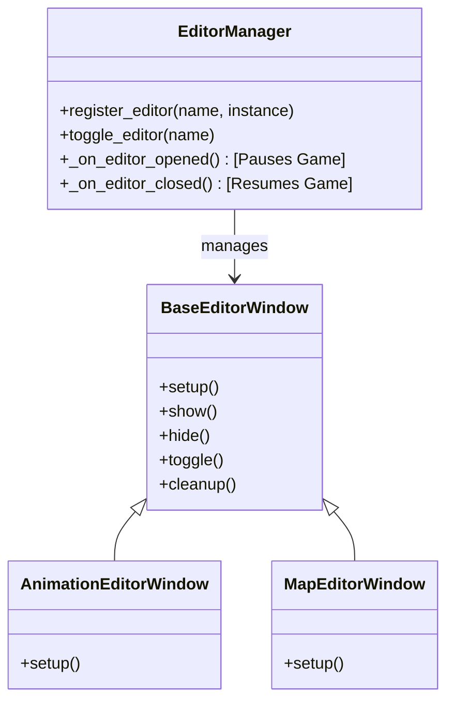

# Engine Tooling Architecture

> [!IMPORTANT]
> The Engine Tooling Suite provides the foundation for all in-game content creation tools. It imposes a strict separation between **Runtime Game Logic** and **Editor Tools**.

---

## core Principles

### 1. Separation of Concerns

- **Game Code** (`engine.game`, `game.py`) focuses on *playing* the game.
- **Editor Code** (`engine.ui.editors.*`) focuses on *creating* content.
- Editors inject themselves into the game loop via `EditorManager` but do not alter core game logic classes directly.

### 2. Base Architecture

All editors must inherit from `BaseEditorWindow` and be managed by `EditorManager`.



### 3. State Management

- **Editing Mode**: When an editor is open:
  - Game State -> `PAUSED`
  - Cursor -> `UNLOCKED`
  - Input -> Directed to Editor UI
- **Play Mode**: When all editors are closed:
  - Game State -> `PLAYING`
  - Cursor -> `LOCKED` (Camera Control)

---

## Directory Structure

```
engine/
  ui/
    base_editor.py       # Abstract Base Class
    editor_manager.py    # Central Registry & State Manager
    
    # Specific Tools
    animation_editor.py  # Animation Tool
    map_editor.py        # (Planned) Voxel Map Editor
    
    # Shared Widgets
    timeline_widget.py   # Animation Timeline
    # (Future)
    inspector_widget.py  # Property Inspector
    hierarchy_widget.py  # Scene Tree
    asset_browser.py     # File Browser
```

---

## Creating a New Tool

### 1. Inherit from BaseEditorWindow

```python
from engine.ui.base_editor import BaseEditorWindow
from direct.gui.DirectGui import DirectLabel

class MyNewTool(BaseEditorWindow):
# ...
```

### 2. Registration in VoxelGame

```python
# engine/game.py
from engine.ui.editors.my_tool import MyNewTool

def _setup_editors(self):
# ...
```

### 3. Binding Toggle Key

```python
self.accept('f5', lambda: self.editor_manager.toggle_editor("My Tool"))
```

---

## UI Standards

### Styling

- **Theme**: Dark Mode (Background: `#141414`, Panel: `#1F1F1F`, Accent: `#32CD32`)
- **DirectGUI**: Use standard Panda3D GUI for now.
- **Scaling**: UI elements should be scalable for different resolutions.

### UX Patterns

- **Toggle Behavior**: Press key to open, press same key (or Escape/Close button) to close.
- **Feedback**: Immediate visual feedback for all actions.

### Safety

- Auto-save or non-destructive editing where possible.

---

*Last Updated: 2026-01-01*
